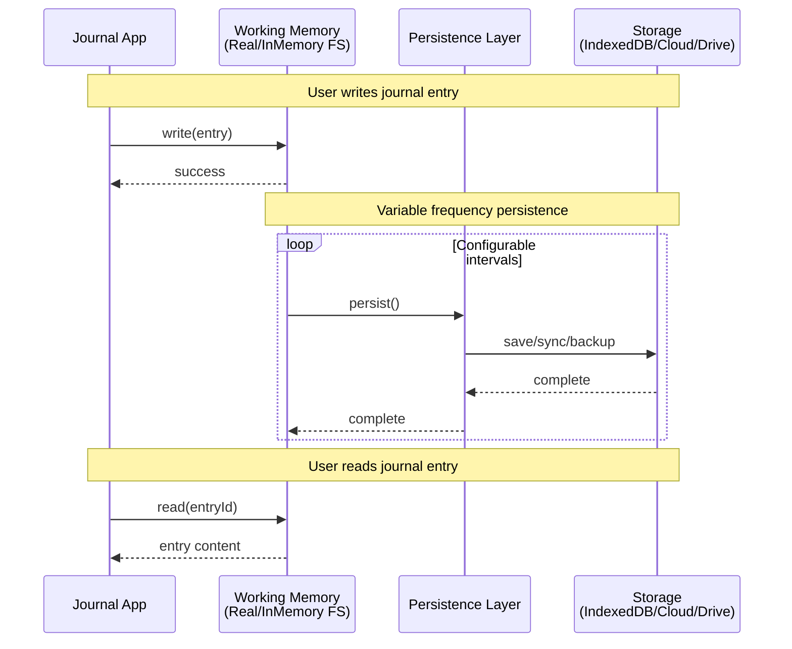
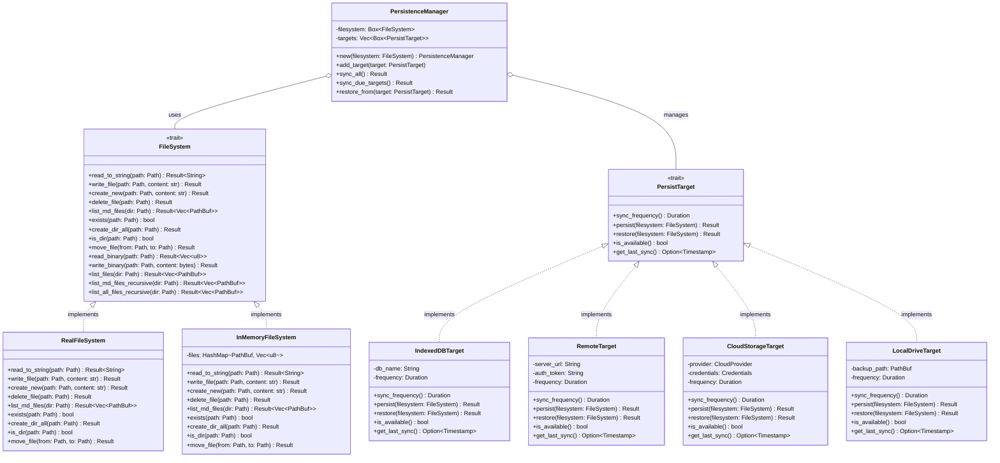

# Roadmap

## v0.6.0

### Sync/Backup

A similar system already exists in apps/web for the WebAssembly/IndexedDB backend. It uses an InMemoryFilesystem and regularly "persists" to IndexedDB. Similarly, the user could set up multiple "backends" and have Diaryx persist to certain ones at certain intervals.

- Google Drive, file/folders, and so forth
- Configurable intervals/sync behavior
- Possibly live edit/CRDT?

Here is the class diagram for the current FileSystem trait and a potential PersistTarget:

 
### Workspace import

Import from Obsidian (add all part_of/contents properties + index files)

Better validation
 
### Links between files

Click to seamlessly navigate to other files
Currently tries to open path in domain (treats like literal link)

## Future considerations

### Better documentation

We have just one README file right now.

### Undo/redo

I would like `diaryx undo` and `diaryx redo` commands to undo/redo any command that was previously done, because it is easy to make mistakes.

### Encryption

Ideally hot-swappable similar to backup backends. Maybe Cryptomator?

### Dark mode

Save eyeballs!

### Math/diagrams

TipTap has an extension for LaTeX, but I would like to support Mermaid diagrams and Typst syntax as well. Maybe there is a way to swap parsers and return an image?